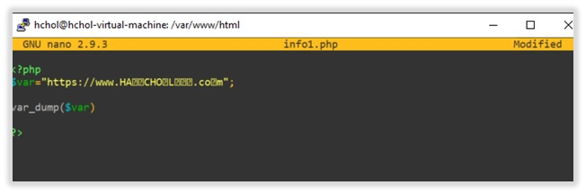
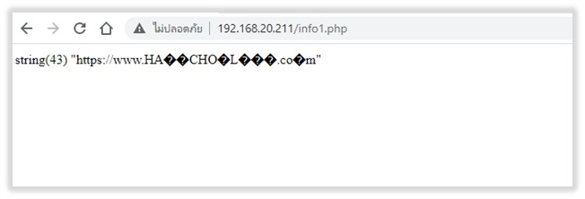
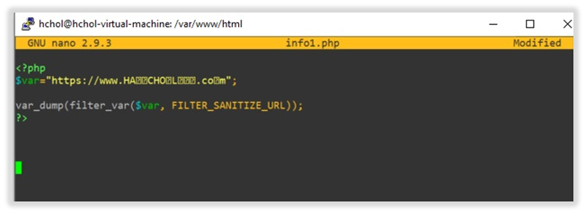
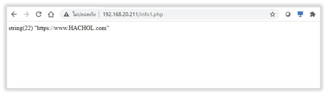

# Input Validate ตอนที่ 1
## FILTER_SANITIZE_URL() บน PHP

แน่นอนว่าหากโปรแกรมมีการรับข้อมูล (input) เข้ามาจากฟอร์มกรอกข้อมูลหรือนำเข้าจากการเชื่อมต่อส่งข้อมูลระหว่างโปรแกรมก็ตาม ในบางครั้งไม่สามารถควบคุมลักษณะข้อมูลที่นำเข้า จนเกิดมีผลกระทบสร้างความเสียหายให้กับระบบได้ ดังนั้นจำเป็นจะต้องกรองและตรวจสอบความถูกต้องของข้อมูลก่อนเสมอ เช่น ผู้ไม่หวังดีอาจจะใช้อักขระที่ไม่เหมาะสมสำหรับระบุชื่อ URL หรือส่งข้อมูล HTML/JavaScript แทรกข้อมูลที่ผิดพลาดเข้ามาใน Browser เพื่อให้มีผลกระทบต่อเจ้าของ web site หรืออาจะเป็นจุดเริ่มต้นผู้ไม่ประสงค์ดีดำเนินการเข้าสู่ระบบอย่างไม่พึงประสงค์ได้  ดังตัวอย่างการนำเข้าค่าข้อมูลที่เป็น URL ที่ผิดพลาดและ Source Code ไม่ได้มีการกรองข้อมูล

ตัวอย่างข้อมูลตัวแปรที่มีการนำเข้าชื่อ URL ที่มีอักขระไม่ถูกต้อง หากไม่มีการกรองอักขระที่ไม่เหมาะสมออก ก็จะทำให้ข้อมูลที่นำเข้ามานั้นมีอักขระที่ผิดพลาดผสมอยู่ ดังรูป

Function  FILTER_SANITIZE_URL สามารถช่วยกรองอักขระที่ผิดพลาดออกไปได้จากรูปเป็นการนำค่า input จากตัวอย่างแรกผ่านการกรองโดยใช้ FILTER_SANITIZE_URL  

หลังจากใช้ Function FILTER_SANITIZE_URL ทำให้อักขระที่ไม่ต้องการจะถูกกรองออกไปดังรูป

แหล่งข้อมูลอ้างอิง

https://www.elithecomputerguy.com/2019/12/mysql-sanitize-variables-with-php-filter_var/
https://blog.eduonix.com/web-programming-tutorials/php-filters/

