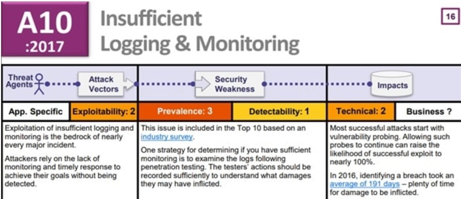

# Logging.basicConfig()


```
Log & Monitoring สิ่งสำคัญที่ไม่ควรมองข้าม !!! 
```

แม้ว่าเป็นเรื่องที่ไม่ค่อยมีการกล่าวถึงมากนักถึงรายละเอียดของข้อมูล Log ที่จะต้องบันทึกจัดเก็บแต่ในแง่ของ Security แล้ว Log & Monitoring นั้นมีความสำคัญมากทีเดียว ข้อมูลจาก OSWAP Top 10 ปี 2017 ระบุว่าข้อมูล log ที่จัดเก็บไม่เพียงพอมีโอกาศให้เกิดความเสี่ยงสูงติดอันดับ TOP-10

 <span style="color: orange"> OWASP Top 10 ,2017  </span>
 <span style="color: orange"> อันดับ 10. Insufficient Logging & Monitoring  </span>



ดังนั้นผู้เขียนขอนำแนวทางการจัดเก็บข้อมูล Logs พร้อมกับตัวอย่างการใช้ method ง่ายๆ บน Python สำหรับสร้างข้อมูล Log จากตำแหน่งที่ต้องการบน Python Code

  # แนวทางการจัดเก็บ Logs  
หากมีการจัดเก็บข้อมูลที่ละเอียดอ่อนจะต้องพิจารณาเนื้อหาของข้อมูล logs อย่างรอบคอบโดยเฉพาะข้อมูลที่ละเอียดอ่อนเนื่องจากอาจจะมีผลกระทบสูงหากข้อมูลที่บันทึกได้หลุดหายหรือถูกทำลาย เช่นข้อมูลบัตรเครดิต เป็นต้น (ผู้เขียนมาแนะนำการใช้ Method ในการ Mark ข้อมูลแบบง่ายๆ มาเสนออีกครั้ง) ดังนั้นในการพิจารณาขั้นตอนการบันทึกข้อมูล Logs ต้องมีกลไกควบคุมเพื่อให้สิ่งที่บันทึกมีเฉพาะข้อมูลที่จำเป็นและเกี่ยวข้องเท่านั้น ซึ่งมีรายละเอียดที่ต้องพิจารณาดังนี้
 - จะต้องตรวจสอบข้อมูลว่า Application ไม่บันทึกค่า Credential หรือข้อมูลที่สำคัญเช่น ข้อมูลเลขบัญชีและบัตรเครดิต ส่วนข้อมูลที่เกี่ยวกับ Session Token จะต้องบันทึกในรูปของค่า hashed เท่านั้น 
จะต้องตรวจสอบข้อกำหนดการบันทึกข้อมูล Logs ให้เป็นไปตามข้อกำหนดของนโยบายหรือกฏหมายที่เกี่ยวข้อง เช่นข้อมูลส่วนบุคคลซึ่งแต่ละท้องถิ่นจะกำหนดไว้แตกต่างกัน

 - ข้อมูล Log ที่บันทึกจะต้องมีการบันทึกรายละเอียดกิจกรรม ถึงผลการพิสูจน์ตัวตน Authentication และผลการตรวจสอบข้อมูล input validation เพื่อให้ผู้ดูแลระบบได้ทราบถึงความปลอดภัยและประสิทธิภาพของการควบคุม     

 # การใช้ method เพื่อสร้างไฟล์และจัดเก็บ Logs 
นอกจาก log ที่ระบบได้ตั้งค่าให้จัดเก็บไว้เป็นค่าเริ่มต้นแล้ว เราสามารถเพิ่มการจัดเก็บข้อมูล logs ซึ่งจะทำให้ Application มีความเสี่ยงลดลง ซึ่งทำได้ง่ายๆ เพียงแค่ใช้ loggig.basicConfig() method ดังตัวอย่าง


ผลจากคำสั่ง จะสร้างไฟล์ log ขึ้นมาพร้อมรายละเอียดที่ได้จัดเก็บสำหรับตรวจสอบข้อมูลเพิ่มเติมได้ภายหลัง 


```
------------------------------------------------------------------------
```

อ้างอิง

 `https://owasp.org/www-project-top-ten `
 `https://gitlab.com/NEIS0736/2020/-/wikis/Requirement/V7.1-Log-Content-Requirements `


                                                                     


